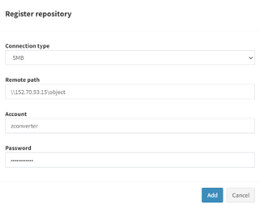

# OCI-object-storage-mount-guide
The process of mounting Object Storage for use as file storage.

## Steps
1. Verify information to access object storage.

2. Install the tool (s3fs-fuse) for mounting and register environment variables.

3. Mount the object storage.

4. Add a ZDM repository.

---

### Step 1.
1.	Generate an access-key and secret-key to access object storage.

    

2.	Click the Generate Secret Key button to generate the secret-key and access-key.

    

    Save the printed secret key and access key.

3.	Create an OCI bucket.

4.	Save the namespace value for the bucket.

    

5.	Verify and save the OCI object storage endpoint. here is [endpoint list](https://docs.oracle.com/en-us/iaas/api/#/en/s3objectstorage/).

### Step 2.
Install rclone, a tool for mounting object storage, and register environment variables.

1.	Install rclone on the ZDM server with the command below.
    ```
    apt install -y rclone
    ```

2.	Create a file in ~/.config/rclone/rclone.conf using the configuration file template and examples below.
    ```
    ## configuration file template
    [PROFILE_NAME]
    type = s3
    env_auth = false
    access_key_id = YOUR_ACCESS_KEY
    secret_access_key = YOUR_ACCESS_SECRET_KEY
    region = YOUR_REGION_IDENTIFIER
    endpoint = https://YOUR_NAMESPACE.compat.objectstorage.YOUR_REGION_IDENTIFIER.oraclecloud.com

    ## Example
    [OCI_ZDM]
    type = s3
    env_auth = false
    access_key_id = 1d55dcd0e83c67e982b...
    secret_access_key = LPVWHWkKcF9OEa4...
    region = ap-seoul-1
    endpoint = https://<namespace>.compat.objectstorage.ap-seoul-1.oraclecloud.com
    ```

### Step 3.

1.	Mount to the repository with the command below.
    ```
    rclone mount <PROFILE_NAME>:<BUCKET_NAME> <MOUNT_PATH> --daemon

    ##Example
    rclone mount OCI_ZDM:ZConverter-bucket /home/ubuntu/test --daemon
    ```

### Step 4.
1.	Modify the ***`/etc/samba/smb.conf`*** file to share the mounted folder.

2.	Register the repository in the ZDM portal.
    
    a.	***Access the ZDM portal, and click the Management-ZDM tab.***
        

    b.	***Select the ZDM where you want to register the repository.***
        

    c.	***Click the Add Repository button.***
        

    d.	***After entering the information according to the given form, click the Add button to register the repository.***
    <p align="center">
        
    </p>
